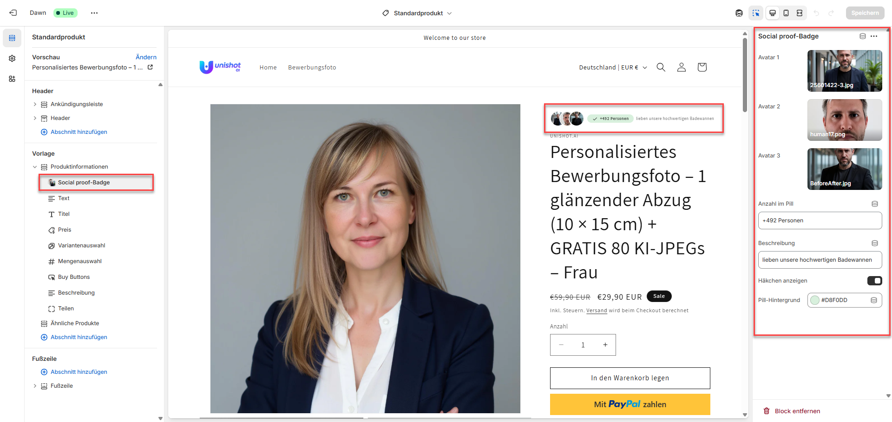

# Social Proof Badge Block for Shopify
<p align="center">
  
</p>
A lightweight Liquid **snippet** and **schema configuration** that displays overlapping customer avatars, a pill‑shaped badge with a dynamic count (optionally with a check‑mark), and a customizable phrase — perfect for boosting trust next to your product title.

## Prerequisites

* **Online Store 2.0** theme (e.g. *Dawn*)
* Write access to your theme’s **`snippets/`** and **`sections/`** folders

---

## Quick Start

### 1. Create the snippet

**File:** `snippets/social-proof-badge.liquid`

```liquid

  Social‑Proof Badge – markup + scoped CSS (no schema here!)



  .social-proof-badge {
    display: flex;
    align-items: center;
    gap: .55rem;
    font-size: .85rem;
    line-height: 1;
    white-space: nowrap;
  }

  .social-proof-avatars {
    display: flex;
    position: relative;
  }

  .social-proof-avatar {
    width: 34px;
    height: 34px;
    border-radius: 50%;
    object-fit: cover;
    border: 2px solid #fff;
  }

  .social-proof-avatar:not(:first-child) {
    margin-left: -14px;
  }

  .social-proof-pill {
    display: flex;
    align-items: center;
    padding: 2px 10px;
    border-radius: 999px;
    background: {{ block.settings.pill_bg }};
    font-weight: 600;
  }

  .social-proof-pill svg {
    width: 14px;
    height: 14px;
    margin-right: 4px;
  }


<div class="social-proof-badge">
  <div class="social-proof-avatars">
    
      
      
        
      
    
  </div>

  <div class="social-proof-pill">
    
      <svg viewBox="0 0 24 24" aria-hidden="true" fill="currentColor">
        <path d="M9 16.2L5.5 12.7l-1.4 1.4L9 19l10-10-1.4-1.4z" />
      </svg>
    
    <span>{{ block.settings.count }}</span>
  </div>

  <span>{{ block.settings.phrase }}</span>
</div>
```

---

### 2. Extend `sections/main-product.liquid`

#### 2.1 Add the block schema

Inside the existing `` block, find the **`"blocks": []`** array and add:

```jsonc
{
  "type": "social-proof-badge",
  "name": "Social proof badge",
  "settings": [
    { "type": "image_picker", "id": "avatar1", "label": "Avatar 1" },
    { "type": "image_picker", "id": "avatar2", "label": "Avatar 2" },
    { "type": "image_picker", "id": "avatar3", "label": "Avatar 3" },
    { "type": "text",      "id": "count",          "label": "Count text",      "default": "+492 people" },
    { "type": "text",      "id": "phrase",         "label": "Description",     "default": "love our premium bathtubs" },
    { "type": "checkbox",  "id": "show_checkmark", "label": "Show check‑mark", "default": true },
    { "type": "color",     "id": "pill_bg",        "label": "Pill background", "default": "#d8f0dd" }
  ]
}
```

#### 2.2 Render the block

Locate your block loop:

```liquid

  
    ...
  

```

Add a new `when` branch:

```liquid

  
```

---

### 3. Add & configure in the Theme Editor

1. Open **Online Store › Customize**.
2. Navigate to any product page.
3. In **Product information**, click **Add block** → **Social proof badge**.
4. Drag the block next to (or below) the product title.
5. Upload avatar images, adjust the count, phrase, and colors — done!

---

## Customization Tips

| Goal | How to achieve it |
| ---- | ---------------- |
| Show more than three avatars | Increase the `for avatar in (1..3)` loop and duplicate the corresponding `image_picker` settings. |
| Responsive font sizes | Wrap `.social-proof-badge` rules in custom `@media` queries. |
| Move CSS to a global stylesheet | Remove the `` tag and paste the CSS into `assets/base.css`. |

---

## Troubleshooting

* **“Unknown tag ‘schema’”** — A `` block was placed in a **snippet**. Only **sections** support schema; snippets must remain schema‑free.

## License

MIT

---

Made with ❤️ for Shopify Online Store 2.0 themes.
